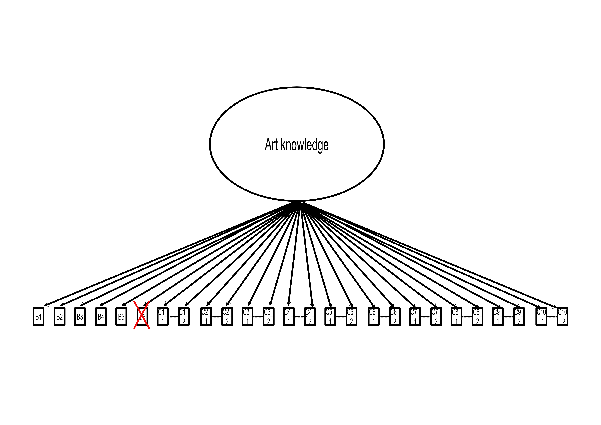

# Introduction

```{r}
library(readxl)
library(lavaan) # CFA analysis
library(semTools) # Compare Fit
library(dplyr)
library(tidyr)
```

```{r, results='hide', fig.show='hide'}

DB_EvaSpe = read_excel("C:\\Users\\matte\\OneDrive\\Documenti\\Desktop\\VAIAK\\Italian VAIAK\\Tesi magistrale VAIAK\\VAIAK Austrian control.xlsx")

DB_MatMai = read.csv("C:\\Users\\matte\\OneDrive\\Documenti\\Desktop\\VAIAK\\Italian VAIAK\\Data Italian VAIAK clean\\VAIAK.csv")
```

```{r, results='hide', fig.show='hide'}
DB_EvaSpe = DB_EvaSpe %>%
  select(-Country.OG, -Nationality, - Context) %>%
    mutate(
      across(starts_with("AI"), as.numeric),              # Part A as numeric
      across(starts_with("B"), as.numeric),               # Part B as numeric
      across(starts_with("C") & ends_with("Numeric"), as.numeric)) %>%
  mutate(
    Language = factor(Language), 
    Language.OG = factor(Language.OG),
    Expertise = factor(Expertise), 
    Gender = factor(Gender), 
    Age = as.numeric(Age)) %>%
  mutate(
    Expertise = factor(case_when(
      Expertise == "Expert" ~ "Expert",
      Expertise == "Novice" ~ "Lay person",
      TRUE     ~ NA_character_))) %>%
  filter(!is.na(Expertise))  # NA expertise

DB_MatMai = DB_MatMai %>%
  rename(
    Age = D1_Age,
    Expertise = D_Expertise,
    Gender = D2_Gender)

DB_EvaSpe = DB_EvaSpe %>%
  select(
    Language, 
    Age, 
    Expertise, 
    Gender, 
    AI_1_1 : AI_2_4, 
    B1_Numeric : B6_Numeric, 
    C1_1_Numeric, C1_2_Numeric,
    C2_1_Numeric, C2_2_Numeric,
    C3_1_Numeric, C3_2_Numeric,
    C4_1_Numeric, C4_2_Numeric,
    C5_1_Numeric, C5_2_Numeric,
    C6_1_Numeric, C6_2_Numeric,
    C7_1_Numeric, C7_2_Numeric,
    C8_1_Numeric, C8_2_Numeric,
    C9_1_Numeric, C9_2_Numeric,
    C10_1_Numeric, C10_2_Numeric)

DB_MatMai = DB_MatMai %>%
  select(
    Language, 
    Age, 
    Expertise, 
    Gender, 
    AI_1_1 : AI_2_4, 
    B1_Numeric : B6_Numeric, 
    C1_1_Numeric, C1_2_Numeric,
    C2_1_Numeric, C2_2_Numeric,
    C3_1_Numeric, C3_2_Numeric,
    C4_1_Numeric, C4_2_Numeric,
    C5_1_Numeric, C5_2_Numeric,
    C6_1_Numeric, C6_2_Numeric,
    C7_1_Numeric, C7_2_Numeric,
    C8_1_Numeric, C8_2_Numeric,
    C9_1_Numeric, C9_2_Numeric,
    C10_1_Numeric, C10_2_Numeric)

##### One database

DB_Multigroup = bind_rows(DB_EvaSpe, 
                          DB_MatMai)

```

In this document I will present results of the CFA carried on for the data collected with the VAIAK questionnaire. 

The VAIAK is a questionnaire composed by two independent and continous scales: 

- Art Interest (AI) includes 11 items. These are either about subjective interest (e.g., I am interested in art) or behaviors (e.g., I go to visit art exhibitions). Each item is rated on a 7-point Likert scale. Items of subjective interest are rated from “not at all” (1) to “very much” (7), while behavioral items range from “less than once a year” (1) to “once a week or more often” (7).

- Art Knowledge (AK) includes 26 items, divided into two parts. In part B (6 items) each item contains an artwork, a question about the image and four possible answers, of which only one is correct. The theme of the questions varies from iconography to techniques and materials. In part C there are 10 images, for each the participant is asked to write the name of the artist and the style (total 26 items).

# Participants

The data here used are part of two different databases. The first one (German speakers) was collected by the original author of the VAIAK, and then shared with us. The second one (Italian speakers) is the one collected for the validation process of the Italian version of the VAIAK: 

- German speakers: 1489 total, 1299 naive, 190 experts

- Italian speakers: 537 total, 300 naive, 236 experts

The CFA will be carried on using a multigroup method for the Language variable. 

To judge the fit of the model the following criteria will be used: CFI > 0.95, RMSEA < .08, SRMR < 0.08

# CFA - Art Interest

## AI - Individual groups - One factor model

The first scale controlled is the Art Interest one. 

We start by checking the fit of the model for the two groups. We will check the following model. 


First we check the Italian population. 

```{r, results='hide', fig.show='hide'}
Model_AI_1 = "interest  =~ AI_1_1 + AI_1_2 + AI_1_3 + AI_1_4 + AI_1_5 + AI_1_6 + AI_1_7 +
                       
                           AI_2_1 + AI_2_2 + AI_2_3 + AI_2_4"  

AI_one = cfa(Model_AI_1, data = DB_MatMai, std.lv=TRUE)  

parameters = summary(AI_one, fit.measures=TRUE, standardized = TRUE, ci=TRUE) # parameters

parameters = data.frame(parameters$test$standard$stat[1], parameters$test$standard$pvalue, 
               unname(parameters$fit[9]), 
               unname(parameters$fit[10]), 
               unname(parameters$fit[17]), 
               unname(parameters$fit[25]))
```

```{r}
knitr::kable(
  parameters, 
  title = c("Modello unifattoriale AI"), 
  col.names = c("$\\chi^2$","$p$ $\\chi^2$", "CFI", "TLI", "RMSEA", "SRMR"),
  digits = 3, 
  align = "c")
```

Then we check the German-speaking population.

```{r, results='hide', fig.show='hide'}
AI_one = cfa(Model_AI_1, data = DB_EvaSpe, std.lv=TRUE)  

parameters = summary(AI_one, fit.measures=TRUE, standardized = TRUE, ci=TRUE) # parameters

parameters = data.frame(parameters$test$standard$stat[1], parameters$test$standard$pvalue, 
               unname(parameters$fit[9]), 
               unname(parameters$fit[10]), 
               unname(parameters$fit[17]), 
               unname(parameters$fit[25]))
```

```{r}
knitr::kable(
  parameters, 
  title = c("Modello unifattoriale AI"), 
  col.names = c("$\\chi^2$","$p$ $\\chi^2$", "CFI", "TLI", "RMSEA", "SRMR"),
  digits = 3, 
  align = "c")
```

For neither population the indices of CFI and RMSEA indicate a good fit, thus we proposed a hierachical model instead. 

## AI - Individual groups - Hierarchical model


First we check the Italian population.  

```{r, results='hide', fig.show='hide'}
Model_AI_hier = "interest_subj =~ AI_1_1 + AI_1_2 + AI_1_3 + AI_1_4 + AI_1_5 + AI_1_6 + AI_1_7

                interest_beha =~ AI_2_1 + AI_2_2 + AI_2_3 + AI_2_4

                interest_subj ~~ interest_beha" # model  

AI_hier_ITA = cfa(Model_AI_hier, data = DB_MatMai, std.lv=TRUE)  

parameters = summary(AI_hier_ITA, fit.measures=TRUE, standardized = TRUE, ci=TRUE) # parameters

parameters = data.frame(parameters$test$standard$stat[1], parameters$test$standard$pvalue, 
               unname(parameters$fit[9]), 
               unname(parameters$fit[10]), 
               unname(parameters$fit[17]), 
               unname(parameters$fit[25]))
```

```{r}
knitr::kable(
  parameters, 
  title = c("Modello gerarchico AI"), 
  col.names = c("$\\chi^2$","$p$ $\\chi^2$", "CFI", "TLI", "RMSEA", "SRMR"),
  digits = 3, 
  align = "c")
```

Then we check the German-speaking population 

```{r, results='hide', fig.show='hide'}
AI_hier_GER = cfa(Model_AI_hier, data = DB_EvaSpe, std.lv=TRUE)  

parameters = summary(AI_hier_GER, fit.measures=TRUE, standardized = TRUE, ci=TRUE) # parameters

parameters = data.frame(parameters$test$standard$stat[1], parameters$test$standard$pvalue, 
               unname(parameters$fit[9]), 
               unname(parameters$fit[10]), 
               unname(parameters$fit[17]), 
               unname(parameters$fit[25]))
```

```{r}
knitr::kable(
  parameters, 
  title = c("Modello unifattoriale AI"), 
  col.names = c("$\\chi^2$","$p$ $\\chi^2$", "CFI", "TLI", "RMSEA", "SRMR"),
  digits = 3, 
  align = "c")
```


The indices shows a better fit, however not yet acceptable. 

## AI - Individual groups - Corrected model

As such we explore the modification indices of each groups. In particular here we can present the first five for each group. 

The first are Italian-speakers, the second the German-speakers

```{r}
modindices(AI_hier_ITA, sort = TRUE, maximum.number = 5)

modindices(AI_hier_GER, sort = TRUE, maximum.number = 5)
```

The correlations between interest_subj =~ AI_2_3 and AI_1_5 ~~ AI_1_6 are present in both of them. 

While the other items of AI_2 indicates very times consuming activities (museum attendence, art events and reading art books), items AI_2_3 measures how much one watch images of art. Thus the items of AI_2 can be understtod as more representative of "insitutional participation" while AI_1 as more general interest, which would explain why the item AI_2_2 has a high correlation.

The items AI_1_5 and AI_1_6 measure very similar behaviour: 

- AI_1_5: Sono sempre alla ricerca di nuove sensazioni ed esperienze artistiche

- AI_1_6: Nel mio quotidiano mi viene naturale prestare attenzione ad oggetti d'arte che trovo affascinanti

We can open the parameters and then check the Italian population

```{r, results='hide', fig.show='hide'}
Model_AI_correct = "interest_subj =~ AI_1_1 + AI_1_2 + AI_1_3 + AI_1_4 + AI_1_5 + AI_1_6 + AI_1_7

                interest_beha =~ AI_2_1 + AI_2_2 + AI_2_3 + AI_2_4

                interest_subj ~~ interest_beha

                AI_1_5 ~~ AI_1_6

                interest_subj ~~ AI_2_3" # model  

AI_corr_ITA = cfa(Model_AI_correct, data = DB_MatMai, std.lv=TRUE)  

parameters = summary(AI_corr_ITA, fit.measures=TRUE, standardized = TRUE, ci=TRUE) # parameters

parameters = data.frame(parameters$test$standard$stat[1], parameters$test$standard$pvalue, 
               unname(parameters$fit[9]), 
               unname(parameters$fit[10]), 
               unname(parameters$fit[17]), 
               unname(parameters$fit[25]))
```

```{r}
knitr::kable(
  parameters, 
  title = c("Modello unifattoriale AI"), 
  col.names = c("$\\chi^2$","$p$ $\\chi^2$", "CFI", "TLI", "RMSEA", "SRMR"),
  digits = 3, 
  align = "c")
```


and then the German speaking one

```{r, results='hide', fig.show='hide'}
AI_corr_ITA = cfa(Model_AI_correct, data = DB_EvaSpe, std.lv=TRUE)  

parameters = summary(AI_corr_ITA, fit.measures=TRUE, standardized = TRUE, ci=TRUE) # parameters

parameters = data.frame(parameters$test$standard$stat[1], parameters$test$standard$pvalue, 
               unname(parameters$fit[9]), 
               unname(parameters$fit[10]), 
               unname(parameters$fit[17]), 
               unname(parameters$fit[25]))
```

```{r}
knitr::kable(
  parameters, 
  title = c("Modello unifattoriale AI"), 
  col.names = c("$\\chi^2$","$p$ $\\chi^2$", "CFI", "TLI", "RMSEA", "SRMR"),
  digits = 3, 
  align = "c")

```

## AI - Multigroups

```{r, results='hide', fig.show='hide'}

## configural 

AI_hier = cfa(Model_AI_correct, data = DB_Multigroup, group = "Language", std.lv=TRUE)

parameters_AI = summary(AI_hier, fit.measures=TRUE, standardized = TRUE, ci=TRUE) # parameters

## metric

AI_hier_met = cfa(Model_AI_correct, data = DB_Multigroup, group = "Language", std.lv=TRUE, 
             group.equal = "loadings")  

parameters_AImet = summary(AI_hier_met, fit.measures=TRUE, standardized = TRUE, ci=TRUE) # parameters

## scalar

AI_hier_scal = cfa(Model_AI_correct, data = DB_Multigroup, group = "Language", std.lv=TRUE, 
             group.equal = c("loadings", "intercepts"))

parameters_AIscal = summary(AI_hier_scal, fit.measures=TRUE, standardized = TRUE, ci=TRUE) # parameters_AIscal

parameters_AItot = data.frame(
  Model = c("configural", "metric", "scalar"),
  chi2 = c(parameters_AI$test$standard$stat[1], parameters_AImet$test$standard$stat, parameters_AIscal$test$standard$stat), 
  p_chi2 = c(parameters_AI$test$standard$pvalue, parameters_AImet$test$standard$pvalue, parameters_AIscal$test$standard$pvalue),  
  CFI = c(parameters_AI$fit[9], parameters_AImet$fit[9], parameters_AIscal$fit[9]),  
  TLI = c(parameters_AI$fit[10], parameters_AImet$fit[10], parameters_AIscal$fit[10]),
  RMSEA = c(parameters_AI$fit[17], parameters_AImet$fit[17], parameters_AIscal$fit[17]), 
  SRMR = c(parameters_AI$fit[25], parameters_AImet$fit[25], parameters_AIscal$fit[25]), 
  Delta_CFI = c(NA, parameters_AI$fit[9] - parameters_AImet$fit[9], parameters_AImet$fit[9] - parameters_AIscal$fit[9]), 
  Delta_RMSEA = c(NA, parameters_AI$fit[17] - parameters_AImet$fit[17], parameters_AImet$fit[17] - parameters_AIscal$fit[17]), 
  Delta_SRMR = c(NA, parameters_AI$fit[25] - parameters_AImet$fit[25], parameters_AImet$fit[25] - parameters_AIscal$fit[25])) 
```

```{r}
knitr::kable(
  parameters_AItot, 
  title = c("Modello gerarchico AI"), 
  col.names = c("Model", "chi2","p_chi2", "CFI", "TLI", "RMSEA", "SRMR", "Delta_CFI", "Delta_RMSEA", "Delta_SRMR"),
  digits = 4, 
  align = "c")
```

To judge the differences I'll use the following criteria: ΔCFI (< 0.010), and ΔRMSEA (< 0.015). 

The results indicate an acceptable fit for the configural model. This means that the basic factor structure is equivalent across the two groups. When adding the equal factor loading constraints across both groups, the model fit has a small and acceptable change. This means that the items have the same weight in both groups. 
Lastly the scalar model failed in the fit. The difference for the CFI is higher than the acceptable limit. This indicates that there is a difference in the intercepts. 


# CFA - Art Knowledge

For the AK we carry on the same analysis, using this model



However we will exclude the item B6. This is because the German participants completed the old version of the VAIAK, where item B6 had different possible answers. This was changed after a series of analysis using IRT. The Italian version uses the revised version, the VAIAK-R.

## AK - Individual groups

```{r, results='hide', fig.show='hide'}
Model_AK_1 = "knowledge  =~ B1_Numeric + B2_Numeric + B3_Numeric + B4_Numeric + B5_Numeric +
                            C1_1_Numeric + C1_2_Numeric + C2_1_Numeric + C2_2_Numeric + C3_1_Numeric +
                            C3_2_Numeric + C4_1_Numeric + C4_2_Numeric + C5_1_Numeric + C5_2_Numeric +
                            C6_1_Numeric + C6_2_Numeric + C7_1_Numeric + C7_2_Numeric + C8_1_Numeric +
                            C8_2_Numeric + C9_1_Numeric + C9_2_Numeric + C10_1_Numeric + C10_2_Numeric

                            C1_1_Numeric ~~ C1_2_Numeric
                            C2_1_Numeric ~~ C2_2_Numeric
                            C3_1_Numeric ~~ C3_2_Numeric
                            C4_1_Numeric ~~ C4_2_Numeric
                            C5_1_Numeric ~~ C5_2_Numeric
                            C6_1_Numeric ~~ C6_2_Numeric
                            C7_1_Numeric ~~ C7_2_Numeric
                            C8_1_Numeric ~~ C8_2_Numeric
                            C9_1_Numeric ~~ C9_2_Numeric
                            C10_1_Numeric ~~ C10_2_Numeric" # model

AK_one_ITA = cfa(Model_AK_1, data = DB_MatMai, std.lv=TRUE)  

parameters = summary(AK_one_ITA, fit.measures=TRUE, standardized = TRUE, ci=TRUE) # parameters

parameters = data.frame(parameters$test$standard$stat[1], parameters$test$standard$pvalue, 
               unname(parameters$fit[9]), 
               unname(parameters$fit[10]), 
               unname(parameters$fit[17]), 
               unname(parameters$fit[25]))
```

```{r}
knitr::kable(
  parameters, 
  title = c("Modello unifattoriale AK"), 
  col.names = c("$\\chi^2$","$p$ $\\chi^2$", "CFI", "TLI", "RMSEA", "SRMR"),
  digits = 3, 
  align = "c")
```

Then we check the German-speaking population.

```{r, results='hide', fig.show='hide'}
AK_one_GER = cfa(Model_AK_1, data = DB_EvaSpe, std.lv=TRUE)  

parameters = summary(AK_one_GER, fit.measures=TRUE, standardized = TRUE, ci=TRUE) # parameters

parameters

parameters = data.frame(parameters$test$standard$stat[1], parameters$test$standard$pvalue, 
               unname(parameters$fit[9]), 
               unname(parameters$fit[10]), 
               unname(parameters$fit[17]), 
               unname(parameters$fit[25]))
```

```{r}
knitr::kable(
  parameters, 
  title = c("Modello unifattoriale AK"), 
  col.names = c("$\\chi^2$","$p$ $\\chi^2$", "CFI", "TLI", "RMSEA", "SRMR"),
  digits = 3, 
  align = "c")
```

## AK - Multigroups

```{r, results='hide', fig.show='hide'}

## configural 

AK_one = cfa(Model_AK_1, data = DB_Multigroup, group = "Language", std.lv=TRUE) # run the model

parameters_AK = summary(AK_one, fit.measures=TRUE, standardized = TRUE, ci=TRUE) # parameters

## metric

AK_one_met = cfa(Model_AK_1, data = DB_Multigroup, group = "Language", std.lv=TRUE, 
             group.equal = "loadings") # run the model

parameters_AKmet = summary(AK_one_met, fit.measures=TRUE, standardized = TRUE, ci=TRUE) # parameters_AKmet

## scalar

AK_ger_scal = cfa(Model_AK_1, data = DB_Multigroup, group = "Language", std.lv=TRUE, 
             group.equal = c("loadings", "intercepts"))

parameters_AKscal = summary(AK_ger_scal, fit.measures=TRUE, standardized = TRUE, ci=TRUE) # parameters_AKscal

parameters_AKtot = data.frame(
  Model = c("configural", "metric", "scalar"),
  chi2 = c(parameters_AK$test$standard$stat[1], parameters_AKmet$test$standard$stat, parameters_AKscal$test$standard$stat), 
  p_chi2 = c(parameters_AK$test$standard$pvalue, parameters_AKmet$test$standard$pvalue, parameters_AKscal$test$standard$pvalue),  
  CFI = c(parameters_AK$fit[9], parameters_AKmet$fit[9], parameters_AKscal$fit[9]),  
  TLI = c(parameters_AK$fit[10], parameters_AKmet$fit[10], parameters_AKscal$fit[10]),
  RMSEA = c(parameters_AK$fit[17], parameters_AKmet$fit[17], parameters_AKscal$fit[17]), 
  SRMR = c(parameters_AK$fit[25], parameters_AKmet$fit[25], parameters_AKscal$fit[25]), 
  Delta_CFI = c(NA, parameters_AK$fit[9] - parameters_AKmet$fit[9], parameters_AKmet$fit[9] - parameters_AKscal$fit[9]), 
  Delta_RMSEA = c(NA, parameters_AK$fit[17] - parameters_AKmet$fit[17], parameters_AKmet$fit[17] - parameters_AKscal$fit[17]), 
  Delta_SRMR = c(NA, parameters_AK$fit[25] - parameters_AKmet$fit[25], parameters_AKmet$fit[25] - parameters_AKscal$fit[25])) 
```

```{r}
knitr::kable(
  parameters_AKtot, 
  title = c("Modello gerarchico AK"), 
  col.names = c("Model", "chi2","p_chi2", "CFI", "TLI", "RMSEA", "SRMR", "Delta_CFI", "Delta_RMSEA", "Delta_SRMR"),
  digits = 3, 
  align = "c")
```

To judge the differences I'll use the following criteria: ΔCFI (< 0.010), and ΔRMSEA (< 0.015). 
The results indicates that the configural model has a good fit. The metric model has, instead, a difference for the CFI higher than the acceptable limit. This means that the different items have a different factor loading across the groups. 

## AK - Factor loadings

A major difference in terms of fittings seems to happen after checking the model with the same factor loadings. Thus we explore the difference between the the German and Italian speakers. 

```{r}
load = subset(parameterEstimates(AK_one, standardized = TRUE), op == "=~")

print(load |>
  select(lhs, rhs, group, std.all) |>
  pivot_wider(names_from = group, values_from = std.all)|>
  mutate(diff = `1` - `2`) |>
  mutate(flag = abs(diff) > 0.15), n = Inf)
```

The column flag indicated differences (absolute) higher than 0.15. 

AK contain 16 images. 5 of these represent an Italian artwork, for a total of 7 items: B1, B4, B5, C2_1, C2_1, C5_1, C5_2.

When checking what Italian items have a difference over 0.15, only B1 appears. 

So, it seems reasonable to say that the difference in terms of factor loadings cannot be explained by the "Italianity" of certain items.

# Conclusion

When presented with adjusted model, both the AI and AK scales show a good configural invariance. 

For the AI scale, the Metric Invariance seems to be stable until the scalar model. It seems that the the groups have a different in terms of intercepts, which could be caused by the larger percentage of lay people in the German group. 

For the AK scale we can notice a unsufficient fit already with the metric model. This indicates a difference in the factor loadings. This may be cause by different reason. In this case one possibility (the possible facilitating nature of the Italian items) was tested. However this first possibility doesn't seem to be sustain by the analysis. A second possibility may be also caused by the larger proportion of the lay people. As claimed in Specker (2020) it may be understandable that an item is more influential in a group than another. For example an item may be very important for the final score of lay people, but too easy, and as such not that relevant, for the expert group. 

However what this analysis show is that the configurial model is fit. Thus the comparison between the two groups is acceptable. 


